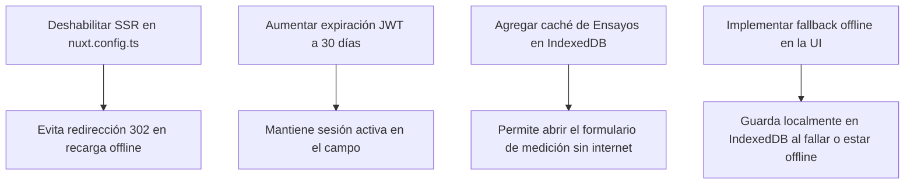

# Plan de Implementación: Modo Offline y Solución de Redirecciones Erráticas

Este plan detalla el diagnóstico del comportamiento errático de la aplicación (redirecciones al home/login), la justificación técnica de la viabilidad y necesidad del modo offline en el sistema de gestión de ensayos (TMS), y los pasos para implementar una solución robusta offline-first.

---

## Diagnóstico del Comportamiento Errático

El usuario ha reportado que, al cargar mediciones en el campo, la aplicación se redirige repentinamente al Home (`/`) o al Login (`/login`). Se observaron peticiones fallidas como `Failed to fetch` y redirecciones HTTP `302 Found` al acceder a páginas protegidas como `/bloques`.

Tras revisar la arquitectura de la aplicación, identificamos las dos causas principales de este comportamiento:

### 1. Conflicto de Autenticación con SSR (Server-Side Rendering) en Producción
* **Problema**: En `nuxt.config.ts`, SSR está habilitado en producción (`ssr: process.env.NODE_ENV === 'production'`). Cuando el navegador pierde la conexión o falla al cargar un módulo dinámico, el manejador de errores de la aplicación (`plugins/error-handler.ts`) intenta resolverlo recargando la página con `window.location.reload()`.
* **Causa**: Al recargar la página, la primera petición va al servidor Nuxt para renderizar el HTML (SSR). El middleware de autenticación (`middleware/auth.ts`) se ejecuta en el servidor. Dado que `localStorage` no existe en el servidor, el servidor Nuxt evalúa la sesión como inexistente (`isAuthenticated === false`) y responde con un código de estado `302 Found` redirigiendo al navegador a `/login`.
* **Efecto de Rebote**: Cuando el navegador carga `/login`, se ejecuta el código del lado del cliente. Allí, `authStore.initializeAuth()` restaura exitosamente el token desde el `localStorage` del navegador. El middleware en el cliente detecta que el usuario sí está autenticado y está en `/login`, por lo que lo redirige automáticamente a la página de inicio (`/`). 
* **Resultado**: El técnico en el campo es expulsado de su pantalla de mediciones y enviado de vuelta al home, perdiendo el progreso no guardado.

### 2. Expiración de Token JWT Demasiado Corta
* **Problema**: En el backend, el parámetro `JWT_EXPIRATION_TIME` está configurado en `3600` (1 hora).
* **Causa**: Una jornada de trabajo en el campo dura típicamente entre 4 y 8 horas. Cuando el token expira (después de 1 hora de haber iniciado sesión), cualquier petición HTTP posterior devuelve un error `401 Unauthorized`. El cliente intercepta este 401 en `useApi.ts`, borra las credenciales y redirige a `/login`.
* **Resultado**: El usuario es deslogueado en pleno campo. Dado que la señal de internet es deficiente, no puede volver a iniciar sesión (la petición de login falla), quedando totalmente imposibilitado de usar la app.

---

## Propuesta y Viabilidad del Modo Offline

> [!IMPORTANT]
> **El modo offline es ALTAMENTE RECOMENDABLE y esencial para este proyecto.**
> Los técnicos agrónomos toman mediciones en lotes agrícolas donde la conectividad es inestable o nula. Obligarlos a depender de una conexión activa causará fallos constantes y frustración.

### Gestión de Conflictos Multiusuario
El usuario plantea la preocupación de que múltiples usuarios puedan editar el mismo ensayo o tomar mediciones en el mismo campo. Evaluamos esto de la siguiente manera:
1. **Ámbito Acotado**: El modo offline se aplicará **exclusivamente a la carga de mediciones de campo (`DatosCampo`, `DatosCampoMedicion`, `FotoRegistro`)**. La configuración del ensayo (creación, asignación de parcelas, tratamientos) seguirá siendo una operación online realizada desde la oficina. Esto reduce drásticamente el riesgo de conflictos.
2. **Resolución por diseño (Last Write Wins)**: El backend (`DatosCampoService`) identifica los registros únicamente por la tupla `(parcela_id, momento_id)`. Si ya existe una medición para esa parcela y momento, el backend **reemplaza** las mediciones anteriores. Esto implementa de forma nativa una política de "el último que sincroniza gana". En la práctica, es muy poco común que dos técnicos midan la *misma parcela* en el *mismo momento* el mismo día. Sin embargo, para mayor seguridad, podemos incluir una fecha de actualización en el cliente para avisar si se está sobrescribiendo información.

---

## Cambios Propuestos



### 1. Configuración de Nuxt (Frontend)
#### [MODIFY] [nuxt.config.ts](file:///media/Datos/Projects/WebstormProjects/TrialManagementSystem/tms-backend/tms-client-vue/nuxt.config.ts)
* Cambiar la propiedad `ssr` a `false` de forma definitiva:
  ```typescript
  ssr: false, // Deshabilitar SSR. La app se compila y ejecuta como una Single Page Application (SPA).
  ```
  *Razón*: Al ser una aplicación privada basada en autenticación por token y requerir soporte offline (IndexedDB, PWA), el renderizado en servidor (SSR) no aporta valor y genera el bucle de redirecciones descrito en el diagnóstico.

### 2. Configuración del Backend
#### [MODIFY] [tms-backend/.env](file:///media/Datos/Projects/WebstormProjects/TrialManagementSystem/tms-backend/.env)
* Incrementar el valor de `JWT_EXPIRATION_TIME` a al menos 30 días (`2592000`) para garantizar que la sesión persista durante toda la campaña de mediciones:
  ```env
  JWT_EXPIRATION_TIME=2592000
  ```

---

### 3. Implementación de Caching y Offline-First (Frontend)

#### [MODIFY] [stores/offline.ts](file:///media/Datos/Projects/WebstormProjects/TrialManagementSystem/tms-backend/tms-client-vue/stores/offline.ts)
* Añadir un nuevo Object Store en IndexedDB llamado `cached_trials` para guardar la estructura estática del ensayo (bloques, parcelas, variables, momento e historial de mediciones).
* Crear métodos para almacenar y recuperar la información del ensayo:
  * `cacheTrialData(ensayoId, data)`
  * `getCachedTrialData(ensayoId)`
  * `isTrialCached(ensayoId)`

#### [MODIFY] [pages/mediciones/[id]/momento/[momentoId].vue](file:///media/Datos/Projects/WebstormProjects/TrialManagementSystem/tms-backend/tms-client-vue/pages/mediciones/%5Bid%5D/momento/%5BmomentoId%5D.vue)
* **Carga de Datos**: Al montar la página (`onMounted`), intentar cargar la información desde la API. Si falla la red (u `offlineStore.isOnline === false`), buscar la estructura y variables del ensayo en `cached_trials` dentro de IndexedDB.
* **Guardado de Datos**: Modificar `guardarYSiguiente`:
  * Si la app está **online**, guardar directamente en el backend vía API.
  * Si la app está **offline** (o la petición falla por red), interceptar el error y usar `offlineStore.saveMedicionLocal(...)` para encolar la medición en `pending_mediciones` en IndexedDB. Mostrar un Toast/notificación estilizado indicando: *"Guardado localmente (pendiente de sincronización)"*.
  * Actualizar el estado local en pantalla para que el técnico visualice el progreso de la parcela medida como "guardado localmente" en la matriz de navegación.

#### [NEW] Componente de Descarga Offline en Detalle de Ensayo
* Agregar un botón en la interfaz (por ejemplo, en el listado de mediciones del ensayo) para que el usuario pueda "Descargar para uso Offline" manualmente antes de salir al campo.
* Al presionarlo, la app descargará y almacenará en `cached_trials` toda la estructura necesaria:
  1. Detalles del Ensayo
  2. Parcelas y Tratamientos
  3. Variables de evaluación asociadas
  4. Mediciones tomadas previamente en ese momento

---

---

## Estado de Implementación (Actualizado 2026-06-23)

### Bugs Diagnosticados y Corregidos

#### Bug Crítico 1: `cacheTrialData` sobreescribía la caché (CORREGIDO)
**Síntoma**: Al visitar la página de momento *online* después de descargar offline, la clave `aplicaciones` era destruida porque `cacheTrialData` hacía `store.put(...)` reemplazando todo el registro.
**Corrección**: `stores/offline.ts` — `cacheTrialData` ahora lee los datos existentes y hace un merge. Las claves no presentes en la actualización se conservan. Los arrays `datosCampo` se combinan por `id`.

#### Bug Crítico 2: `cached.momento` era `undefined` en modo offline (CORREGIDO)
**Síntoma**: El botón "Descargar Offline" guarda `aplicaciones` con momentos anidados, pero NO una clave `momento` directa. La página de momento buscaba `cached.momento` → siempre `undefined`.
**Corrección**: `pages/mediciones/[id]/momento/[momentoId].vue` — Se agregó la función `buscarMomentoEnCache()` que recorre `cached.aplicaciones` para encontrar el momento correcto. Se aplica en ambos paths (fallo online y modo offline).

#### Bug Importante: Error de importación dinámica con TypeError (CORREGIDO)
**Síntoma**: `Uncaught (in promise) TypeError: Failed to fetch dynamically imported module`. El plugin `error-handler.ts` chequeaba `typeof event.reason === 'string'`, pero la excepción de `dynamic import` es un objeto `TypeError`, no una string — por lo que el manejador nunca se ejecutaba.
**Corrección**: `plugins/error-handler.ts` — El handler ahora extrae `reason.message` para objetos Error. Además:
- **Online**: recarga la página (corrige URLs de módulos desactualizadas por HMR)
- **Offline**: muestra advertencia en consola (no puede recargar sin conexión)

#### Bug Convención: `alert()`/`confirm()` en páginas de mediciones (CORREGIDO)
Reemplazados todos los `alert()` y `confirm()` en `mediciones/index.vue`, `mediciones/[id]/index.vue` y `mediciones/[id]/momento/[momentoId].vue` por llamadas a `showNotification()` de `useNotifications`.

#### Limitación Dev vs Producción (documentada, no es un bug de código)
**En modo desarrollo** (Vite dev server), DevTools "Offline" bloquea TODOS los requests incluyendo `localhost:3001`. Esto impide cargar módulos de páginas `.vue` aún si los datos están en IndexedDB.
**En producción** (build estático con `npm run build`), todos los chunks JS están pre-cargados al inicio de la sesión y no requieren red para navegar. El modo offline de DevTools no los afecta.
**Recomendación para pruebas offline reales**: Usar `npm run build && npm run preview` en lugar del dev server.

---

## Plan de Verificación

### Pruebas Automatizadas
* Dado que el frontend no cuenta con un framework de pruebas configurado, realizaremos validaciones a nivel de compilación y ejecución de scripts.

### Verificación Manual (Paso a Paso)
1. **Verificación de Redirecciones (SSR)**:
   * Acceder a la app, iniciar sesión, y navegar a la pantalla de mediciones `/mediciones/X/momento/Y`.
   * En DevTools de Chrome, activar la opción **Offline** en la pestaña de red.
   * Presionar F5 (recargar página).
   * **Resultado esperado**: La página debe recargarse en el cliente utilizando la caché del navegador, sin redirigirse a `/login` ni a `/`.
2. **Verificación de Carga Offline**:
   * Estando online, presionar el botón "Descargar para uso Offline" de un ensayo específico.
   * Cambiar a modo **Offline** en el navegador.
   * Entrar a la pantalla de mediciones del ensayo descargado.
   * **Resultado esperado**: La pantalla debe cargar correctamente la matriz de parcelas, las variables y las observaciones utilizando los datos cacheados.
3. **Verificación de Guardado y Sincronización**:
   * Estando offline, ingresar valores para una parcela y presionar "Guardar".
   * **Resultado esperado**: La app debe avanzar a la siguiente parcela indicando que se guardó localmente. El contador del botón flotante de `OfflineIndicator` debe incrementarse a 1.
   * Cambiar a modo **Online** en el navegador.
   * Presionar "Sincronizar ahora" en el indicador flotante (o esperar la sincronización automática).
   * **Resultado esperado**: Las mediciones guardadas localmente se deben enviar al backend y eliminarse de la cola de pendientes en IndexedDB. Validar en la base de datos que el registro se creó o actualizó correctamente.
